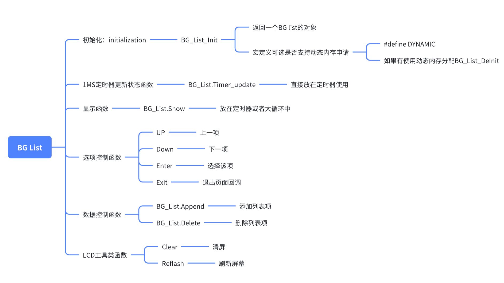

# BanGUI
Some UI for mcu 

# Runnig for Linux

## Install SDL2

```
sudo apt-get update
sudo apt-get install libsdl2-dev
```
## Bulid project

```
cd build
cmake ..
make 
```
## Running
```
./BanGUI
```

# UI object

## BG_List

### introduation
#### This UI object is designed for Encoder-bottun and small-size TFT-LCD.
 
 

